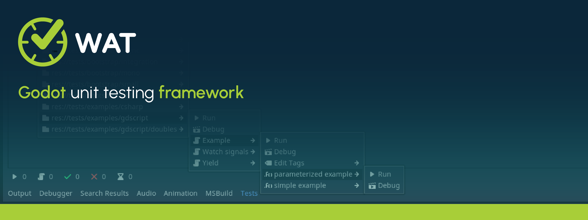

[](https://alexdarigan.github.io/WAT/)

# [WAT](https://alexdarigan.github.io/WAT/) 
 [](https://ko-fi.com/Q5Q51D9K5)

A Godot unit-testing framework for GDScript and C#. It includes an inspector window for manually running tests, and a command-line interface for easy automated testing.

1. [Install](#Install)
2. [Project Settings](#ProjectSettings)
3. [GUI](#GUI)
4. [CLI](#CLI)
5. [Example Tests](#Examples)
6. [Assertions](#Assertions)
6. [Continuous Integration](#ContinuousIntegration)

## Install
<a name="Install"></a>

0. It is advised to download WAT from the Godot Asset Library.
1. You may download WAT or WAT Mono from the release page.
2. Extract the downloaded zip file.
3. Add the addons folder from the extracted files to your Godot Project.
4. Enable the Plugin in Project -> Project Settings -> Plugin Tab
5. You should see a new "Tests" button in the bottom middle bar of the Godot Editor.

## Project Settings
<a name="ProjectSettings"></a>
Once you have enabled the WAT Plugin, you will be able to see the settings in 
ProjectSettings -> General -> Wat (right at the bottom). If you don't see it, you may
need to close the project settings and then re-open.

- *Test Directory*

    The test directory is where WAT will look for your tests. It defaults to your project's root
    but it is suggested to use a dedicated tests folder. You can also use an absolute path external to your
    project (like "C:/Users/YourName/YourProject/Tests").

- *Results Directory* 

    The results directory is where WAT will store the results of your tests in JUnit Standard XML. It defaults to
    your project's root but it is suggested to store it inside your tests folder. This is usefulfor those of you 
    who use Continous Integration (such as the github workflow action for WAT itself.) 

- *Metadata Directory*

    The metadata directory is where WAT will store metadata about your test scripts. Namely wheter they failed the last time and which tags they have been given. It defaults to your project's root but it is suggested to be stored in your
    test directory.

- *Tags*

    You can add string tags to your test so that you can run tests that are split across different folders in a group. You
    define which tags can be added in this setting but you do the actual adding via the GUI.

- *Cache Tests*

    Will avoid rescanning your test directory unless changes to them are detected. Disable this if you're using an external editor, since not all changes from an external editor are detected.

- *Window Size*

    Defines the window size when running Tests.

- *Port*

    This port is the port used for debugging tests. It is unlikely you'll need to change this often.

- *Display*

    This defines wheter the Test Panel is stored in the bottom window or one of the many docks around Godot's Editor.

## Graphical User Interface
<a name="GUI"></a>


### Top Left Menu ( Left To Right )

__Run All Tests__

    Runs all tests directly in the Editor. WAT does not have access to the
    debugger when run this way.

    Note: A Rebuild might be required by any User who is using WAT Mono.

__Debug All Tests__

    Runs all tests in the Scene. WAT does have access to the debugger when
    run this way.

__Select Tests__

    Users may select to Run (in editor) or Debug (in scene): previously failed tests, a set of tagged tests, a Directory, Script or a Method.

    Note: Users may organize their tests into nested directories but this is only
    for organizational purposes. WAT will *only* run the top-level tests of any directory.

    Note: To edit the tags of a script, navigate to the script and then to Edit Tags. Check which tags you want the script to have (or uncheck those which you
    don't want it to have)/

__Filter Results__

    Users can choose to collapse all results, expand all results or expand only failures (which will collapse all results but expand the failed methods).

__Repeat X Times__

    Users can choose to repeat a Test Run immediatly so many times. This can help
    when testing erratic bugs where the problem only exists sometimes. Choose 0
    to run the tests once.

__Run on X Thread(s)__

    Users can set the count of threads to run their tests on (to the limit of their
    processor core count - 1 for WAT itself otherwise it will stall).

    Use 1 thread to not run on any additional threads.

    Note: Do not use Repeats & Threads together. There is currently a bug.

__Links__

    A Set of links that may or may not be useful to you.

### Bottom Left Labels ( Left to Right )

__Runs__

    The number of times tests have been run since WAT was open.

__Total Tests__

    The number of total tests scripts ran in the previous Test Run.

__Passed Tests__

    The number of total test scripts that passed in the previous Test Run.

__Failed Tests__

    The number of total test scripts that failed in the previous Test Run.

__Times__

    The time the Test Run is taking (or has taken if finished). This updates
    live.


## Command Line Interface
<a name="CLI"></a>
You can run tests in your command line interface by navigating to your Project Directory and executing the command:  *godot addons/cli.tscn [ARGUMENTS]*

__Run All Tests__

    godot addons/WAT/cli.tscn run=all

__Run Directory__

    // Where X is the path of the directory you want to run
    godot addons/WAT/cli.tscn run=dir+X

__Run Script__

    // Where X is the project path of the script you want to run (Project Path meaning res:// path)
    godot addons/WAT/cli.tscn run=res://script+X

__Run Method__

    // Where X is the absolute path of the script where the method is contained
    // and where Y is the name of the method
    godot addons/WAT/cli.tscn run=method+X+Y

__Run Failed__

    godot addons/WAT/cli.tscn run=failed

__Run Tagged__

    // Where X is the name of the tag you want to run
    godot addons/WAT/cli.tscn run=tag+X

__Repeat Tests__

    godot addons/WAT/cli.tscn run=all repeat=2
    OR
    godot addons/WAT/cli.tscn run=all r=2

    Note: Argument order does not matter so you can do this either
    godot addons/WAT/cli.tscn r=2 run=all

__Run on X Threads__

    godot addons/WAT/cli.tscn run=all thread=3
    OR
    godot addons/WAT/cli.tscn run=all t=3

    Note: Argument order does not matter so you can do this either
    godot addons/WAT/cli.tscn t=2 run=all

## Examples
<a name="GDScriptExamples"></a>
- GDScript Examples
    - [Basic Test](/tests/examples/gdscript/example.test.gd)
    - [Yielding in Tests](/tests/examples/gdscript/yield.test.gd)
    - [Watching Signals in Tests](/tests/examples/gdscript/watch_signals.test.gd)
    - [Test Doubles](/tests/examples/gdscript/doubles)

<a name="CSharpExamples"></a>
- C# Examples
    - [Basic Test](/tests/examples/csharp/ExampleTest.cs)
    - [Awaiting in Tests](/tests/examples/csharp/AwaitTest.cs)
    - [Watching Signals in Tests](/tests/examples/csharp/WatchSignalsTest.cs)

## Assertions
<a name="Assertions"></a>
- [GDScript Assertions](/addons/WAT/assertions/assertions.gd)
- [C# Assertions](/addons/WAT/mono/assertions/Assertions.cs)

## Continuous Integration
<a name="ContinuousIntegration"></a>

You can automatically run your unit tests every time you push changes to your game's repository. Here's some automation templates for popular git hosting services.

**Github**

Paste the stuff below into `.github/workflows/tests.yml`

```yaml
name: 🧪 Run Unit Tests

on: [push, pull_request]

env:
  IMPORT_TIME: 10s   # Controls how long we wait to import our assets

jobs:
  Tests:
    name: Run All Tests on 3.5
    runs-on: ubuntu-latest
    container: barichello/godot-ci:mono-3.5
    steps:
      - name: Checkout Repository
        uses: actions/checkout@v3
        with:
          submodules: recursive

      - name: Install Dependencies
        run: |
          nuget restore
          mkdir -p .mono/assemblies/Debug
          cp /usr/local/bin/GodotSharp/Api/Release/* .mono/assemblies/Debug
      - name: Compile
        run: msbuild

      - name: Reimport Assets
        run: timeout $IMPORT_TIME godot --editor || code=$?; if [[ $code -ne 124 && $code -ne 0 ]]; then exit $code; fi

      - name: Run
        run: godot addons/WAT/cli.tscn run=all 

      - name: Upload Test Results
        if: always()
        uses: actions/upload-artifact@v2
        with:
          name: Test Results
          path: tests/results.xml
```